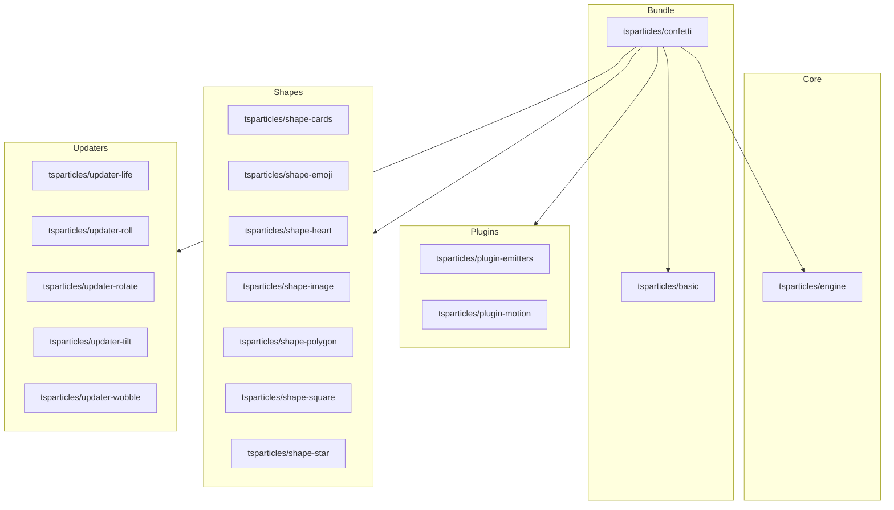

[](https://particles.js.org)

# tsParticles Confetti Bundle

[](https://www.jsdelivr.com/package/npm/@tsparticles/confetti) [](https://www.npmjs.com/package/@tsparticles/confetti) [](https://www.npmjs.com/package/@tsparticles/confetti) [](https://github.com/sponsors/matteobruni)

[tsParticles](https://github.com/tsparticles/tsparticles) confetti bundle to create confetti effects with a single API.

**Included Packages**

- [@tsparticles/basic (and all its dependencies)](https://github.com/tsparticles/tsparticles/tree/main/bundles/basic)
- [@tsparticles/engine](https://github.com/tsparticles/tsparticles/tree/main/engine)
- [@tsparticles/plugin-emitters](https://github.com/tsparticles/tsparticles/tree/main/plugins/emitters)
- [@tsparticles/plugin-motion](https://github.com/tsparticles/tsparticles/tree/main/plugins/motion)
- [@tsparticles/shape-cards](https://github.com/tsparticles/tsparticles/tree/main/shapes/cards)
- [@tsparticles/shape-emoji](https://github.com/tsparticles/tsparticles/tree/main/shapes/emoji)
- [@tsparticles/shape-heart](https://github.com/tsparticles/tsparticles/tree/main/shapes/heart)
- [@tsparticles/shape-image](https://github.com/tsparticles/tsparticles/tree/main/shapes/image)
- [@tsparticles/shape-polygon](https://github.com/tsparticles/tsparticles/tree/main/shapes/polygon)
- [@tsparticles/shape-square](https://github.com/tsparticles/tsparticles/tree/main/shapes/square)
- [@tsparticles/shape-star](https://github.com/tsparticles/tsparticles/tree/main/shapes/star)
- [@tsparticles/updater-life](https://github.com/tsparticles/tsparticles/tree/main/updaters/life)
- [@tsparticles/updater-roll](https://github.com/tsparticles/tsparticles/tree/main/updaters/roll)
- [@tsparticles/updater-rotate](https://github.com/tsparticles/tsparticles/tree/main/updaters/rotate)
- [@tsparticles/updater-tilt](https://github.com/tsparticles/tsparticles/tree/main/updaters/tilt)
- [@tsparticles/updater-wobble](https://github.com/tsparticles/tsparticles/tree/main/updaters/wobble)

## Dependency Graph



## Exposed API

The package API is centered on `confetti`.

```ts
import { confetti } from "@tsparticles/confetti";

// Main API
await confetti(options);
await confetti("canvas-id", options);

// Extra helpers
await confetti.init();
const fireOnCanvas = await confetti.create(canvas, defaultOptions);
await fireOnCanvas(options);

console.log(confetti.version);
```

`@tsparticles/confetti` does not expose `tsParticles` from its main entrypoint.
If you need direct engine APIs, import them from `@tsparticles/engine`.

## Installation

```bash
pnpm add @tsparticles/confetti
```

## How to use it

### ESM / TypeScript

```ts
import { confetti } from "@tsparticles/confetti";

await confetti({
  count: 80,
  spread: 60,
  position: { x: 50, y: 50 },
  colors: ["#ffffff", "#ff0000"],
});
```

With explicit canvas id:

```ts
import { confetti } from "@tsparticles/confetti";

await confetti("tsparticles", {
  count: 50,
  angle: 90,
  spread: 45,
});
```

### Custom canvas via `confetti.create`

```ts
import { confetti } from "@tsparticles/confetti";

const canvas = document.getElementById("my-canvas") as HTMLCanvasElement;
const localConfetti = await confetti.create(canvas, { count: 30 });

await localConfetti({ spread: 70 });
```

### CDN / Vanilla JS / jQuery

The CDN/Vanilla JS version has two files:

- One is a bundle file with all the scripts included in a single file
- One includes only the `confetti` API, where dependencies must be loaded manually

After loading the bundle, `confetti` is available on `globalThis`.

#### Bundle

Use the bundle when you want a single script with all required dependencies.

#### Not Bundle

This installation requires more work since all dependencies must be included in the page. Some lines above are all
specified in the **Included Packages** section.

### Usage

```js
confetti({ count: 60 });
```

```js
(async () => {
  await confetti({ count: 60, spread: 55 });
})();
```

```js
confetti("tsparticles", {
  count: 50,
  position: {
    x: 50,
    y: 50,
  },
});
```

### Options

The `confetti` API accepts:

- `confetti(options)`
- `confetti(id, options)`

Main options:

- `count` _Integer (default: 50)_
- `angle` _Number (default: 90)_
- `spread` _Number (default: 45)_
- `startVelocity` _Number (default: 45)_
- `decay` _Number (default: 0.9)_
- `flat` _Boolean (default: false)_
- `gravity` _Number (default: 1)_
- `drift` _Number (default: 0)_
- `ticks` _Number (default: 200)_
- `position` _Object_ (`x`/`y`, default 50/50)
- `colors` _Array&lt;String&gt;_
- `shapes` _Array&lt;String&gt;_
- `shapeOptions` _Record&lt;string, unknown&gt;_
- `scalar` _Number (default: 1)_
- `zIndex` _Integer (default: 100)_
- `disableForReducedMotion` _Boolean (default: true)_

Deprecated aliases still accepted:

- `particleCount` (use `count`)
- `origin` (use `position`)

## Common pitfalls

- Calling `confetti` before scripts are loaded in CDN usage
- Assuming `tsParticles` is exported by `@tsparticles/confetti` main entrypoint
- Passing no first argument in TypeScript (use `confetti(options)` or `confetti(id, options)`)

## Related docs

- All packages catalog: <https://github.com/tsparticles/tsparticles>
- Main docs: <https://particles.js.org/docs/>
