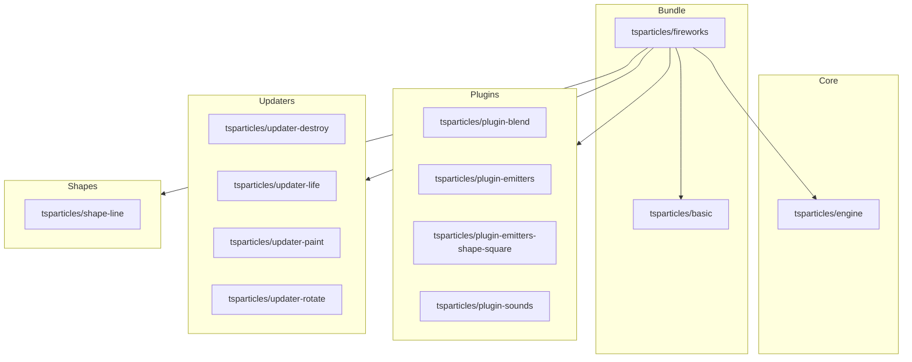

[](https://particles.js.org)

# tsParticles Fireworks Bundle

[](https://www.jsdelivr.com/package/npm/@tsparticles/fireworks) [](https://www.npmjs.com/package/@tsparticles/fireworks) [](https://www.npmjs.com/package/@tsparticles/fireworks) [](https://github.com/sponsors/matteobruni)

[tsParticles](https://github.com/tsparticles/tsparticles) fireworks bundle to create fireworks effects with a focused API.

**Included Packages**

- [@tsparticles/basic (and all its dependencies)](https://github.com/tsparticles/tsparticles/tree/main/bundles/basic)
- [@tsparticles/engine](https://github.com/tsparticles/tsparticles/tree/main/engine)
- [@tsparticles/plugin-blend](https://github.com/tsparticles/tsparticles/tree/main/plugins/blend)
- [@tsparticles/plugin-emitters](https://github.com/tsparticles/tsparticles/tree/main/plugins/emitters)
- [@tsparticles/plugin-emitters-shape-square](https://github.com/tsparticles/tsparticles/tree/main/plugins/emittersShapes/square)
- [@tsparticles/plugin-sounds](https://github.com/tsparticles/tsparticles/tree/main/plugins/sounds)
- [@tsparticles/shape-line](https://github.com/tsparticles/tsparticles/tree/main/shapes/line)
- [@tsparticles/updater-destroy](https://github.com/tsparticles/tsparticles/tree/main/updaters/destroy)
- [@tsparticles/updater-life](https://github.com/tsparticles/tsparticles/tree/main/updaters/life)
- [@tsparticles/updater-paint](https://github.com/tsparticles/tsparticles/tree/main/updaters/paint)
- [@tsparticles/updater-rotate](https://github.com/tsparticles/tsparticles/tree/main/updaters/rotate)

## Dependency Graph



## Exposed API

The package API is centered on `fireworks`.

```ts
import { fireworks } from "@tsparticles/fireworks";

// Main API
const instance = await fireworks();
const byId = await fireworks("canvas-id", options);
const byOptions = await fireworks(options);

// Extra helpers
await fireworks.init();
const custom = await fireworks.create(canvas, options);

console.log(fireworks.version);
```

`@tsparticles/fireworks` does not expose `tsParticles` from its main entrypoint.
If you need direct engine APIs, import them from `@tsparticles/engine`.

## Installation

```bash
pnpm add @tsparticles/fireworks
```

## How to use it

### ESM / TypeScript

```ts
import { fireworks } from "@tsparticles/fireworks";

const instance = await fireworks({
  colors: ["#ffffff", "#ff0000"],
  sounds: false,
});

instance?.pause();
instance?.play();
instance?.stop();
```

With explicit canvas id:

```ts
import { fireworks } from "@tsparticles/fireworks";

await fireworks("tsparticles", {
  rate: 3,
  speed: { min: 10, max: 25 },
});
```

### Custom canvas via `fireworks.create`

```ts
import { fireworks } from "@tsparticles/fireworks";

const canvas = document.getElementById("my-canvas") as HTMLCanvasElement;
await fireworks.create(canvas, { sounds: true });
```

### CDN / Vanilla JS / jQuery

The CDN/Vanilla JS version has two files:

- One is a bundle file with all the scripts included in a single file
- One includes only the `fireworks` API, where dependencies must be loaded manually

After loading the bundle, `fireworks` is available on `globalThis`.

#### Bundle

Use the bundle when you want a single script with all required dependencies.

#### Not Bundle

This installation requires more work since all dependencies must be included in the page. Some lines above are all
specified in the **Included Packages** section.

### Usage

```javascript
fireworks();
```

```javascript
(async () => {
  const instance = await fireworks();

  instance?.pause();
  instance?.play();
  instance?.stop();
})();
```

```javascript
fireworks.create(document.getElementById("custom-id"));
```

#### Options

`fireworks` supports these call signatures:

- `fireworks()`
- `fireworks(options)`
- `fireworks(id, options)`

Main options:

- `background` String: The background color of the canvas, it can be any valid CSS color, can be transparent as well.
- `brightness` Number or { min: number; max: number; }: The brightness offset applied to the particles color, from -100
  to 100.
- `colors` String or _Array&lt;String&gt;_: An array of color strings, in the HEX format... you know, like `#bada55`.
- `gravity` Number or { min: number; max: number; }: The gravity applied to the fireworks particles.
- `minHeight` Number or { min: number; max: number; }: The minimum height for fireworks explosions (the lesser, the
  higher).
- `rate` Number or { min: number; max: number; }: The rate of the fireworks explosions.
- `saturation` Number or { min: number; max: number; }: The saturation offset applied to the particles color, from -100
  to 100.
- `sounds` Boolean: Whether to play sounds or not.
- `speed` Number or { min: number; max: number; }: The speed of the fireworks particles.
- `splitCount` Number or { min: number; max: number; }: The number of particles to split the emitter in.

### Returned instance methods

The resolved `FireworksInstance` exposes:

- `pause()`
- `play()`
- `stop()`

## Common pitfalls

- Calling `fireworks` before scripts are loaded in CDN usage
- Assuming `tsParticles` is exported by `@tsparticles/fireworks` main entrypoint
- Reusing the same `id` unintentionally (the package caches instances by id)

## Related docs

- All packages catalog: <https://github.com/tsparticles/tsparticles>
- Main docs: <https://particles.js.org/docs/>
