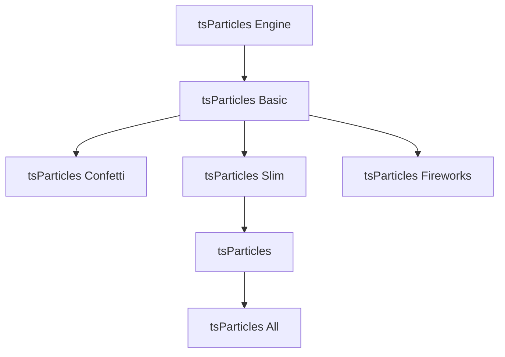

# Dependency Graph

This is a practical map of the package layering exposed in the main `tsParticles` README.

For the full, exhaustive graph, see:

- <https://github.com/tsparticles/tsparticles/blob/main/README.md#dependency-graph>

## High-level package flow

## How to use this map

- Start from `engine` + `slim` for most production apps.
- Move to `tsparticles` if you need extra built-in interactions/plugins.
- Move to `all` only when you need the complete feature set.
- Use dedicated bundles (`confetti`, `fireworks`) for focused effects.

## Related pages

- [`/guide/getting-started`](/guide/getting-started)
- [`/guide/installation`](/guide/installation)
- [`/options/performance`](/options/performance)
